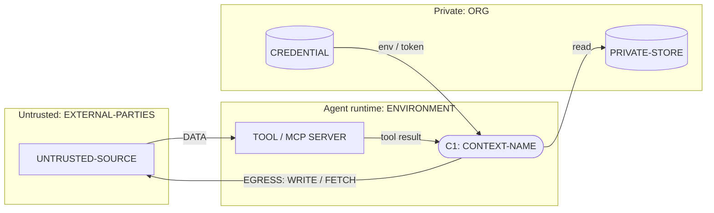

# Threat model: SYSTEM-NAME

| Field | Value |
|---|---|
| System | SYSTEM-NAME and short description |
| Version / commit reviewed | |
| Date | YYYY-MM-DD |
| Authors / reviewers | |
| System owner | |
| Frameworks | OWASP Agentic Top 10 2026; OWASP Agentic AI Threats and Mitigations v1.1; OWASP LLM Top 10 2026 (2025 IDs where noted); MITRE ATLAS v2026.09 |
| Classification | Internal: describes weaknesses; store with security documentation |
| Next review | Date, or trigger: new tool, credential, data source, memory store, model, or MCP server |

## 1. System summary

Three to five sentences: what the system does, who uses it, what triggers the agents, and what the
agents are allowed to change.

## 2. Scope

In scope:
-

Out of scope, and why:
-

Sources reviewed (files, configs, docs, interviews):
-

## 3. Assumptions

Each assumption is a risk if false. Link it to a threat ID when it is load-bearing.

| # | Assumption | Verified? | If false |
|---|---|---|---|
| A1 | Any context that reads untrusted content can be made to follow instructions in it | Design premise | n/a |
| A2 | | | |

## 4. Components and trust boundaries

### 4.1 Agent contexts

| Context | Purpose | Model | Trigger | Runs as (identity) | Tools | Memory read / write | Sub-agents |
|---|---|---|---|---|---|---|---|
| C1 | | | | | | | |

### 4.2 Tools and MCP servers

Classes: RP read-private, RU reads-untrusted, WE writes-external, IRR irreversible.

| Tool | Source (built-in / MCP / skill / plugin) | Pin (version / hash) | Classes | Scope actually granted | Scope needed | Approval required |
|---|---|---|---|---|---|---|
| | | | | | | |

### 4.3 Data stores (memory, RAG, files)

| Store | Contents / classification | Writers | Readers | Tenant or user isolation | Retention |
|---|---|---|---|---|---|
| | | | | | |

### 4.4 Credentials

Location and scope only. Never record values.

| Credential | Held by | Scope | Lifetime | Storage | Passed to |
|---|---|---|---|---|---|
| | | | | | |

### 4.5 Human approval points

| Action | Approver | What the approver sees (exact payload / summary) | Expected volume | Enforced by (harness / UI / policy) |
|---|---|---|---|---|
| | | | | |

### 4.6 Trust boundaries

| ID | Boundary | Crossing flows |
|---|---|---|
| TB1 | Internet / agent runtime | |
| TB2 | | |

## 5. Data-flow diagram

One subgraph per trust zone, one node per agent context, labeled edges. Replace the skeleton.

## 6. Lethal trifecta per context

A context includes sub-agent results and memory loaded into it. List the concrete capability for
each leg, or "none".

| Context | Private data (RP) | Untrusted content (RU) | Exfiltration channel (WE) | All three? | Untrusted + IRR? | Leg broken by (control, enforcement point) |
|---|---|---|---|---|---|---|
| C1 | | | | | | |

## 7. Threat register

Scales, defined in SKILL.md step 5: Likelihood and Impact are H / M / L. Risk: HxH Critical; HxM or
MxH High; MxM, HxL, or LxH Medium; otherwise Low. Sort by risk. Threat sentence: actor via entry
point causes action on asset, with impact. Mitigation names the enforcement point. Status: Open /
Accepted / In progress / Mitigated / Transferred.

| ID | Threat | ASI | LLM(2026) | ATLAS | Likelihood | Impact | Mitigation | Owner | Status |
|---|---|---|---|---|---|---|---|---|---|
| TM-01 | | | | | | | | | |
| TM-02 | | | | | | | | | |

Notes per threat (optional): attack path in conceptual terms, the LLM:2025 ID if needed, related
T-IDs, and evidence (file and line, config key).

## 8. Residual risk and detections

Record what remains after the planned mitigations, who accepted it, and how it would be noticed.

| Threat ID | Residual risk | Accepted by / date | Detection (signal, log source, rule) | Response playbook |
|---|---|---|---|---|
| | | | | |

Logging prerequisites: tool calls with arguments, egress destinations and denials, memory writes,
approvals and rejections, credential issuance. For each, note whether it is available today.

## 9. Open questions

| # | Question | Needed from | Blocks threat IDs |
|---|---|---|---|
| Q1 | | | |

## 10. Change log

| Date | Change | By |
|---|---|---|
| | Initial version | |
